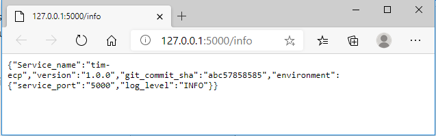
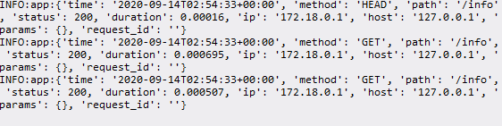
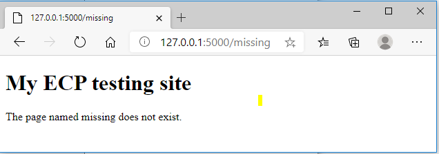

# User Guides

## Prerequisites

*   docker
*   docker compose
*   make
*   python
*   pip
*   git

### Setting up your verification environment

>   Download [anz-ecp/tim-lim ](https://github.com/anz-ecp/tim-lim )repository
>   from GitHub to the local environment (and navigate to the downloaded folder
>   through the command line).

```bash
$ git clone <https://github.com/anz-ecp/tim-lim>
$ cd tim-lim
```
### Build, Deploy and Start the application

A `Dockerfile` which defines all the software requirements is provided to allow
portable build of the test environment. All required python modules are defined
in the `requirements.txt` file. In fact, this test code was fully build on a
Windows 10 environment. Successfully verified on Red Hat 7 EC2 instance for
portable test.

>   To build, deploy and start the test application.

```bash
$ make install
```
>   This will invoke the docker-compose command to build the required docker
>   image defined in the `docker-compose.yml` file.

```bash
   C:.
   │ Makefile
   │ README.md
   │
   ├───app
   │ .dockerignore
   │ app.py
   │ `requirements.txt`
   │
   └───deployments
   │ `docker-compose.yml`
   │
   └───app
           `Dockerfile`
```
>   Content of `docker-compose.yml` file:

```bash
version: "2"
services:
  app:
    container_name: tim-ecp
    build:
      context: ../
      dockerfile: deployments/app/Dockerfile
    ports:
      - "5000:5000"
    environment:
     - service_port=5000
     - log_level=INFO    
```

>   The two stated required environment variables `service_port` and `log_level`
>   which are passed into application on build process.

>   **Notes:**

>   The `ports` and `service_port` must match for the code to able to receive its
>   network traffic. ports `(5000:5000)` is used to define host to container port mapping,
>   that is all traffic on host port `5000` will be re-directed to container port
>   `5000`. The `service_port` is what the application will listen for incoming
>   requests.

>   The `log_level` must be set to `INFO` level to allow Flask framework to display
>   any user defined logged message. The `WARN` level is the default logging level
>   set by Flask. The application is using Flask logging service to report ONLY
>   the incoming requests on the `/info` API endpoint in structured data format.

###  Verify deployment of container

>   Run `docker images list` command to display docker-compose auto assigned
>   image named `deployments_app`

```bash
$ docker image list –format "table{{.ID}}\\t{{.Repository}}\\t{{.Tag}}"
```
```bash
   IMAGE ID REPOSITORY TAG
   7fc06620e0af deployments_app latest
   28a4c88cdbbf python 3
```

>   Run `docker ps` command to display the started container named `tim-ecp` which
>   is sepecified in `docker-compose.yml`

```bash
$ docker ps --format "table{{.ID}}\\t{{.Image}}\\t{{.Names}}\\t{{.Ports}}"
```

```bash
CONTAINER ID IMAGE NAMES PORTS
cf95f6b31042 deployments_app tim-ecp 0.0.0.0:5000-\>5000/tcp
```

### Verify Test Result

>   Run `docker start` command to run attach an interactive terminal session to
>   the running container to allow verifying of the `/info` API endpint served by
>   the container.

```bash
$ docker start -a tim-ecp
```

**You see nothing until you have accessed the `/info` endpoint.**

>   Leave this session alone as the application is written, with pupose, to
>   suppress all other default Flask logging other the targeted `/info` API
>   endpoint requests in structured data form.

>   When you access the <http://127.0.0.1:5000/info> through a Web Client, you
>   should see:



>   Back to the terminal session where you have started docker start command
>   earlier, you should start to see the access to `/info` API endpoint is being
>   reported in structured data format. One line per access request.



>   When you access any other undefined endpoint, for example,
>   <http://127.0.0.1:5000/missing> through a Web Client, you should see a
>   response advising the endpoint does not exist



### Module level Testing conducted

### Prerequisites

*  python 3
*  pip

### Install python modules into local environment

```bash
$ pip install -r app/requirements.txt
```

### Start the test application

```bash
$ python app/app.py
```


>   The verification steps provided in the previous section can be used.

### Development Environment

This piece of development was built entirely on a window 10 desktop involving
the following components:

*   Visual Studio Code Editor and various plugins
*   Docker Desktop for windows
*   Docker Compose
*   Powershell
*   Git client
*   Make
*   Python
*   Pip
*   Winsdows for Linux (Ubuntu distro) but its lack of data persistency was
    found a bit of extra overhead.

The on premises infrastructure (an aged 5 years old laptop computer) has turned
out being a real winner in term of cost for compute and data storage as compared
to the cloud option or in efforts if I have to spin up some virtual unix VM. The
only petty cloud usage cost (probably under a dollar this month) when I
conducted the portability test on AWS EC2 instance for half an hour.

### Possible Code Enhancement 

*   Rendering the API endpoint output
*   Enable Token Authorization for endpoint access

###  Hope you like my code!!! 
